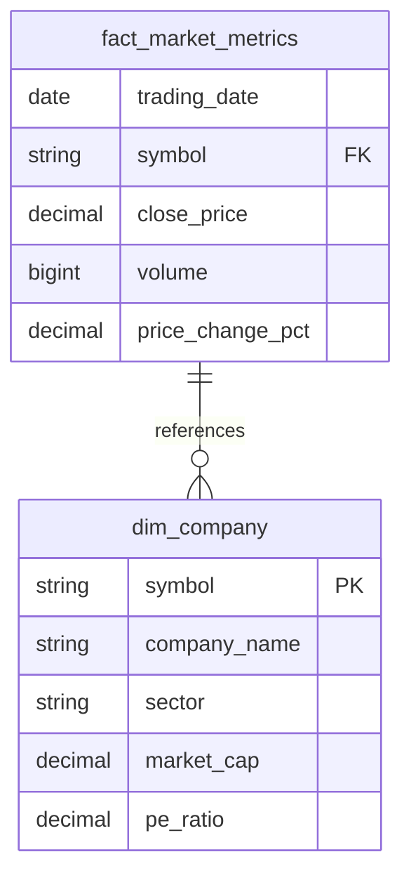

# 📊 DataPipe Analytics

<div align="center">
  


</div>

A production-grade ETL pipeline for processing financial market data using Apache Airflow, dbt, and PostgreSQL. This project demonstrates modern data engineering practices with a focus on reliability, scalability, and performance.

## 🌟 Project Overview

This project implements a robust data engineering pipeline that processes financial market data from Alpha Vantage API. It showcases industry best practices in data engineering including data validation, testing, documentation, and monitoring.

<div align="center">
  


</div>

### ✨ Features

- 🔄 **Real-time Market Data**: Automated extraction of stock market data from Alpha Vantage
- 🛡️ **Data Quality**: Comprehensive data testing and validation using dbt
- 🚀 **Scalable Architecture**: Containerized services with proper health checks and dependency management
- 📊 **Visualization**: Interactive Streamlit dashboard and Metabase BI platform
- 📈 **Technical Analysis**: Built-in indicators and market metrics
- 🔍 **Monitoring**: Built-in logging and health monitoring for all services
- 📚 **Documentation**: Extensive documentation of models, tests, and best practices
- 🖥️ **Resource Optimization**: Support for older hardware with minimal resource requirements

### 🛠️ Tech Stack

<div align="center">
  
| Category | Technology |
|----------|------------|
| **Orchestration** | Apache Airflow 2.7.3 |
| **Data Warehouse** | PostgreSQL 13 |
| **Transformation** | dbt 1.7.3 |
| **Containerization** | Docker & Docker Compose |
| **Programming** | Python 3.9 |
| **Data Source** | Alpha Vantage API |
| **Visualization** | Streamlit & Metabase |
| **Testing** | pytest, dbt tests |

</div>

## 🏗️ Architecture

Our data pipeline follows a modern layered architecture:

<div align="center">
  


</div>

### 📊 Data Model

Our data model follows a star schema design for analytics:

<div align="center">
  


</div>

## 🚀 Getting Started

### Prerequisites

- Docker and Docker Compose
- Python 3.9+
- Make (optional, for using Makefile commands)
- Alpha Vantage API key

### 📥 Local Development Setup

1. Clone the repository:
```bash
git clone https://github.com/javid912/datapipe-analytics.git
cd datapipe-analytics
```

2. Create and activate a virtual environment:
```bash
python -m venv venv
source venv/bin/activate  # On Windows: .\venv\Scripts\activate
```

3. Copy the example environment file and configure your API key:
```bash
cp .env.example .env
# Edit .env and add your Alpha Vantage API key
```

4. Start the services:
```bash
# For standard hardware:
docker-compose up -d

# For older or resource-constrained hardware:
docker-compose -f docker-compose-minimal.yml up -d
```

5. Access the services:
- 📊 **Streamlit Dashboard**: http://localhost:8501
- 📈 **Metabase**: http://localhost:3000 (username: admin@admin.com, password: metabase123)
- 🔄 **Airflow UI**: http://localhost:8080 (username: admin, password: admin)
- 🗄️ **PostgreSQL**: localhost:5432

## ⚡ Performance Optimization

For older or resource-constrained hardware, we provide a minimal Docker Compose configuration:

```bash
docker-compose -f docker-compose-minimal.yml up -d
```

This configuration:
- 🔽 Reduces memory usage for all containers
- 🔽 Limits CPU usage
- ✅ Starts only essential services
- ✅ Optimizes database connections
- ✅ Implements selective computation of technical indicators

## 📁 Project Structure

```
datapipe-analytics/
├── airflow/               # Airflow DAGs and configurations
│   └── dags/             # DAG definitions
├── dbt/                  # Data transformation
│   ├── models/          # dbt models
│   │   ├── staging/    # Staging models
│   │   └── marts/      # Mart models
│   ├── seeds/          # Seed data files
│   └── tests/          # Data tests
├── docker/              # Dockerfile definitions
├── src/                 # Source code
│   ├── dashboard/      # Streamlit dashboard
│   ├── extractors/     # Data extraction modules
│   └── loaders/        # Database loading modules
├── tests/               # Python tests
└── docs/                # Documentation
    └── DEVELOPMENT_JOURNAL.md  # Development history
```

## 📊 Data Models

Our dbt models follow a layered architecture:

<div align="center">
  
| Layer | Purpose | Examples |
|-------|---------|----------|
| **Raw (public_raw)** | Original data from external sources | `raw_stock_prices`, `raw_company_info` |
| **Staging (public_staging)** | Clean, typed data from raw sources | `stg_daily_prices`, `stg_company_info` |
| **Marts (public_marts)** | Business logic transformations for analytics | `dim_company`, `fact_market_metrics` |

</div>

## 🧪 Testing

The project includes comprehensive testing at multiple levels:

- ✅ **dbt tests**: Data quality and business logic validation
- ✅ **Python unit tests**: Code functionality verification
- ✅ **Integration tests**: End-to-end pipeline validation
- ✅ **Container health checks**: Service availability monitoring

## 📈 Visualization

### Streamlit Dashboard

<div align="center">
  
</div>

Our Streamlit dashboard provides:
- 📊 Market overview with key metrics
- 📈 Technical analysis with indicators
- 🔍 Company-specific deep dives
- 📉 Historical price analysis

### Metabase BI Platform

<div align="center">
  
</div>

Metabase offers:
- 📊 Custom SQL queries and visualizations
- 📈 Scheduled reports and alerts
- 🔍 Interactive filtering and exploration
- 📉 Shareable dashboards and insights

Access Metabase at:
- 🔗 URL: http://localhost:3000
- 👤 Default credentials:
  - Email: admin@admin.com
  - Password: metabase123

## 🔍 Monitoring

Our monitoring approach includes:

- 🔄 Service health monitoring via Docker health checks
- 📊 Airflow task monitoring and alerting
- ✅ dbt test coverage and data quality metrics
- 📝 Comprehensive logging for all components

## 🤝 Contributing

We welcome contributions! Please read our [CONTRIBUTING.md](CONTRIBUTING.md) for details on our code of conduct and the process for submitting pull requests.

### 🐛 Issues and Feature Requests

Check out our [Issues](https://github.com/javid912/datapipe-analytics/issues) page to see current tasks, bugs, and feature requests. Feel free to pick up any issue labeled "good first issue" to get started!

## 📄 License

This project is licensed under the MIT License - see the [LICENSE](LICENSE) file for details.

## 🗺️ Roadmap

- ✅ Add Streamlit dashboard for data visualization
- ✅ Implement resource optimization for older hardware
- ✅ Add Metabase integration
- 🔄 Implement real-time data processing
- 🔄 Add more technical indicators
- 🔄 Enhance monitoring and alerting
- 🔄 Add support for more data sources

## 🙏 Acknowledgements

- [Alpha Vantage](https://www.alphavantage.co/) for providing financial market data
- [Apache Airflow](https://airflow.apache.org/) for workflow orchestration
- [dbt](https://www.getdbt.com/) for data transformation
- [Streamlit](https://streamlit.io/) for dashboard creation
- [Metabase](https://www.metabase.com/) for business intelligence