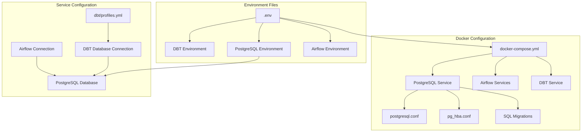

# Development Journal

# DataPipe Analytics Development Journal

## Project Overview
Building a production-grade ETL pipeline for processing financial market data using Apache Airflow, dbt, and PostgreSQL.

## Development Log

### Day 1: Project Setup and Initial Structure

#### 1. Project Structure Setup
Created the initial project structure with all necessary directories:
```
datapipe_analytics/
├── .github/workflows/      # CI/CD workflows
├── airflow/                # Airflow DAGs and plugins
├── dbt/                    # dbt transformations
├── src/                    # Source code
├── tests/                  # Test files
└── docker/                 # Dockerfile definitions
```

#### 2. Docker Environment Setup
- Created `docker-compose.yml` with multiple services:
  * PostgreSQL for data warehouse
  * Airflow (split into init, webserver, and scheduler)
  * dbt for transformations
  * Test service for running tests
- Key Learning: Splitting Airflow into multiple services (init, webserver, scheduler) improves maintainability and follows best practices

#### 3. Configuration Management
- Created `.env.example` for environment variables
- Implemented configuration for:
  * Database credentials
  * Airflow settings
  * Alpha Vantage API key
  * dbt settings
- Key Learning: Using environment variables for configuration allows for easy deployment across different environments

### Day 2: Data Extraction Layer

#### 1. Alpha Vantage Client Implementation
- Created robust API client with:
  * Rate limiting (5 requests/minute)
  * Error handling with custom exceptions
  * Input validation
  * Comprehensive logging
  * Multiple endpoints support (daily prices, intraday, company overview)
- Key Learning: Implementing rate limiting is crucial for API clients to avoid hitting limits

#### 2. Testing Setup
- Implemented comprehensive test suite:
  * Unit tests for validation
  * Integration tests for API calls
  * Fixture usage for test client
  * Environment variable handling in tests
- Key Learning: Using pytest fixtures makes tests more maintainable and reduces code duplication

#### 3. Python Package Structure
- Created proper Python package structure:
  * Added `__init__.py` files
  * Set up `PYTHONPATH` in both local and Docker environments
  * Created `pytest.ini` for test configuration
- Key Learning: Proper package structure is essential for imports to work in both local and Docker environments

### Day 3: Data Loading Layer and Testing

#### 1. Database Schema Design
- Created raw and staging schemas
- Implemented JSONB storage for API data
- Added indexes and triggers
- Key Learning: Using JSONB type in PostgreSQL allows flexible schema evolution while maintaining query performance

#### 2. Database Loader Implementation
- Created DatabaseLoader class with context manager pattern
- Implemented connection pooling
- Added error handling and logging
- Key Learning: Context managers ensure proper resource cleanup in Python

#### 3. Testing Challenges and Solutions
- Initial Issue: Fixture usage errors in pytest
- Problem: Direct fixture calls instead of dependency injection
- Solution: Properly chained fixtures and used pytest's dependency injection
- Key Learning: Fixtures should be used as parameters, not called directly

#### 4. Test Mocking Improvements
- Initial Issue: Type assertion failures with psycopg2.Json
- Problem: Testing for dict instead of Json type
- Solution: Updated assertions to handle psycopg2's Json type
- Key Learning: Mock objects need to match the actual types used in the code

### Day 4: Data Transformation Layer

#### 1. Staging Models Implementation
- Created three staging models:
  * `stg_daily_prices`: Transform raw daily price data
  * `stg_intraday_prices`: Transform intraday trading data
  * `stg_company_overview`: Transform company information
- Key Learning: Using PostgreSQL JSONB operators for efficient data extraction

#### 2. Mart Layer Design
- Created dimension table:
  * `dim_company`: Combines company info with trading stats
- Implemented smart aggregations:
  * Latest company information using window functions
  * 30-day trading statistics
- Key Learning: Using window functions for temporal data management

#### 3. Data Quality Framework
- Implemented comprehensive testing:
  * Not null constraints
  * Uniqueness checks
  * Value validation (e.g., valid intervals)
  * Cross-model relationships
- Key Learning: Balance between data quality and transformation flexibility

### Day 5: Fixing dbt Models and Schema Issues

#### 1. Schema Configuration Issues
- **Problem Identified**: Schema conflicts in dbt models
  * Duplicate model definitions in different schema files
  * Incorrect schema reference for seed files (`raw` vs `public_raw`)
- **Files Affected**:
  * `/dbt/models/staging/schema.yml`
  * `/dbt/models/schema.yml`
  * `/dbt/dbt_project.yml`

#### 2. Understanding dbt Components
- **Models**: SQL files that transform data
  * **Staging Models** (`/dbt/models/staging/`):
    - `stg_daily_prices.sql`: Transforms raw stock prices
    - `stg_company_info.sql`: Transforms company information
  * **Mart Models** (`/dbt/models/marts/`):
    - `dim_company.sql`: Combines company info with latest trading data
    - `fact_market_metrics.sql`: Aggregates market-wide metrics

- **Materializations**:
  * Views for staging layer (faster refresh, no storage)
  * Tables for mart layer (better query performance)

#### 3. Debugging Process
1. **Issue**: Schema conflict with duplicate model definitions
   - Solution: Removed duplicate definitions from `models/schema.yml`
   
2. **Issue**: Wrong schema reference for seed files
   - Solution: Updated source schema from `raw` to `public_raw` in staging models

3. **Issue**: Ambiguous column reference in `dim_company` model
   - Solution: Explicitly specified table reference for ambiguous columns
   ```sql
   SELECT
       company_info.symbol,  -- Explicitly referenced table
       last_close_price * shares_outstanding as market_cap
   FROM company_info
   ```

#### 4. Key Commands Used
- `dbt seed --full-refresh`: Loads CSV files into the database
- `dbt run --full-refresh`: Rebuilds all models from scratch
- Key Learning: `--full-refresh` drops and recreates objects, useful during development

#### 5. Project Structure Insights
```
dbt/
├── models/
│   ├── staging/           # First level transformations
│   │   ├── schema.yml    # Staging model definitions
│   │   ├── stg_daily_prices.sql
│   │   └── stg_company_info.sql
│   ├── marts/            # Business-level transformations
│   │   ├── schema.yml    # Mart model definitions
│   │   ├── dim_company.sql
│   │   └── fact_market_metrics.sql
│   └── schema.yml        # Project-wide definitions
├── seeds/                # Raw data files
│   ├── raw_company_info.csv
│   └── raw_stock_prices.csv
└── dbt_project.yml      # Project configuration
```

#### 6. Best Practices Learned
1. Keep model definitions in their respective schema files
2. Use explicit schema references in source definitions
3. Avoid ambiguous column references in SQL
4. Use appropriate materializations for different layers
5. Document model relationships and dependencies

## Technical Deep Dives

### 1. Docker and Images
- Docker builds create layers in images
- Each build command creates a new layer
- Images are immutable, containers are mutable instances
- Best Practice: Use multi-stage builds to keep final images small

### 2. Testing Components

#### Fixtures in pytest
- Purpose: Provide reusable test setup
- Features:
  * Dependency injection
  * Setup and teardown handling
  * Resource sharing between tests
- Example:
```python
@pytest.fixture
def mock_connection(mock_cursor):  # Dependencies can be other fixtures
    conn = MagicMock()
    conn.cursor.return_value = mock_cursor
    return conn
```

#### Mocking Database Connections
- Purpose: Test database code without actual database
- Components:
  * Mock connection objects
  * Mock cursors
  * Mock query results
- Example:
```python
with patch('psycopg2.connect') as mock_connect:
    mock_connect.return_value = mock_connection
```

#### Context Managers
- Purpose: Resource management (setup/teardown)
- Use Cases:
  * Database connections
  * File handling
  * Lock management
- Testing:
  * Verify proper entry/exit
  * Check resource cleanup
  * Test error handling

### 3. Database Components

#### psycopg2
- Python PostgreSQL adapter
- Features:
  * Native Python types to PostgreSQL conversion
  * Connection pooling
  * Transaction management
  * JSON handling

#### Staging Models
- Purpose: Clean and standardize raw data
- Components:
  * Views or tables
  * Data type conversions
  * Basic validations
- Example:
```sql
WITH source AS (
    SELECT * FROM raw.daily_prices
),
parsed AS (
    SELECT
        symbol,
        (raw_data->>'price')::numeric as price
    FROM source
)
```

### 4. dbt Components

#### Current Setup
1. Models:
   - staging/stg_daily_prices.sql: Transforms raw daily prices
   - More models needed for intraday and company data

2. Schema:
   - sources.yml: Defines raw data sources
   - schema.yml: Defines model structure and tests

#### Planned Extensions
1. Additional Models:
   - staging/stg_intraday_prices
   - staging/stg_company_overview
   - marts/dim_company
   - marts/fact_daily_trading

2. Tests:
   - Data quality checks
   - Business logic validation
   - Relationship checks

### 1. dbt Model Architecture

#### Staging Layer
- Purpose: Clean and standardize raw data
- Features:
  * JSON parsing
  * Data type casting
  * Basic validation
- Example:
```sql
SELECT
    symbol,
    (raw_data->>'price')::NUMERIC as price,
    timestamp::TIMESTAMP as trading_time
FROM raw_data
```

#### Mart Layer
- Purpose: Business-level transformations
- Features:
  * Dimensional modeling
  * Aggregations
  * Business rules
- Example:
```sql
WITH latest_data AS (
    SELECT *,
    ROW_NUMBER() OVER (
        PARTITION BY symbol 
        ORDER BY extracted_at DESC
    ) as rn
    FROM stg_company_overview
)
```

### 2. Data Testing Strategy

#### Test Types
1. Schema Tests:
   - Not null validation
   - Unique constraints
   - Accepted values
   - Relationships

2. Data Quality Tests:
   - Value ranges
   - Data freshness
   - Completeness

3. Business Logic Tests:
   - Aggregation accuracy
   - Temporal consistency
   - Cross-model relationships

### 3. SQL Patterns and Best Practices

#### Common Table Expressions (CTEs)
- Purpose: Break down complex logic
- Benefits:
  * Improved readability
  * Easier maintenance
  * Better performance
- Example:
```sql
WITH source AS (
    SELECT * FROM raw
),
transformed AS (
    SELECT * FROM source
)
SELECT * FROM transformed
```

#### Window Functions
- Purpose: Temporal and partitioned analysis
- Use Cases:
  * Latest records
  * Running totals
  * Moving averages
- Example:
```sql
ROW_NUMBER() OVER (
    PARTITION BY symbol 
    ORDER BY extracted_at DESC
)
```

## Lessons Learned

### 1. Data Modeling
- Start with staging models for clean data
- Use dimensional modeling for analytics
- Implement incremental processing where possible

### 2. Testing
- Test at both staging and mart levels
- Validate business logic explicitly
- Use dbt's built-in test framework

### 3. Performance
- Use appropriate indexes
- Optimize JSON queries
- Consider materialization strategies

## Next Steps

1. Fact Tables:
- Create `fact_daily_trading`
- Create `fact_intraday_trading`
- Implement trading metrics

2. Custom Tests:
- Add data freshness tests
- Implement value range validations
- Create cross-model relationship tests

3. Documentation:
- Add column-level documentation
- Create data lineage diagrams
- Document business rules

## Questions to Consider
1. How to handle late-arriving data?
2. What incremental processing strategy to use?
3. How to optimize for query performance?

## Best Practices Established
1. Always use CTEs for complex transformations
2. Document assumptions in models
3. Test both technical and business requirements
4. Use consistent naming conventions
5. Implement proper error handling

## Common Issues and Solutions

### 1. Fixture Usage Errors
**Problem**: `Fixture "mock_connection" called directly`
**Solution**: 
- Use fixtures as parameters
- Chain fixture dependencies
- Don't call fixtures directly

### 2. Type Assertions in Tests
**Problem**: Json type mismatch
**Solution**:
```python
assert isinstance(call_args[1][1], Json)
assert call_args[1][1].adapted == data
```

## Best Practices Learned

1. Docker:
- Use multi-stage builds when possible
- Keep images minimal
- Use proper health checks
- Implement proper networking

2. Python:
- Use virtual environments
- Implement proper package structure
- Add comprehensive logging
- Use type hints

3. Testing:
- Use fixtures for common setup
- Separate unit and integration tests
- Mock external services when appropriate
- Test both success and error cases 

## Day 7: Environment Troubleshooting and Dashboard Development
> 📁 Related files: `src/dashboard/app.py`, `src/dashboard/requirements.txt`

### Environment and Dependencies Resolution
- **Issue**: Encountered segmentation faults when running the Streamlit dashboard due to Python version and package compatibility issues
- **Resolution**:
  - Migrated from Python 3.8 to Python 3.9
  - Implemented specific version constraints for key dependencies:
    - streamlit==1.24.1
    - pandas==1.5.3
    - plotly==5.18.0
    - psycopg2-binary==2.9.9
  - Successfully resolved segmentation faults and got the dashboard running
> 📄 Dependencies defined in: `src/dashboard/requirements.txt`

### Current Challenges
- **Database Connectivity**: Dashboard is unable to connect to PostgreSQL database
  - Error: "could not translate host name 'postgres' to address"
  - Root cause: Docker container networking issue - dashboard running on host machine cannot resolve Docker container hostname
  - Next steps: Update database connection configuration to use localhost or Docker network bridge
> 📄 Connection configuration: `src/dashboard/.env`, `docker-compose.yml`

### Technical Learnings
1. **Python Environment Management**:
   - Importance of maintaining consistent Python versions across development
   - Critical role of package version compatibility in preventing runtime issues
   - Value of explicit version pinning for core dependencies
> 📄 Environment setup: `requirements.txt`, `src/dashboard/requirements.txt`

2. **Docker Networking**:
   - Need to consider network connectivity between host machine and containerized services
   - Importance of proper host resolution when accessing containerized databases
> 📄 Network configuration: `docker-compose.yml`

### Next Steps
1. Resolve database connectivity by updating connection configuration
2. Implement proper error handling in dashboard for database connection issues
3. Add connection retry logic with appropriate timeout settings

## Day 8: DAG Implementation and Import Error Resolution
> 📁 Related files: `airflow/dags/market_data_pipeline.py`, `docker/airflow.Dockerfile`

### Airflow DAG Implementation and Debugging
- **Initial Challenge**: Import error in Airflow DAG
  - Error: `ModuleNotFoundError: No module named 'src'`
  - Root cause: Python path configuration in Docker container
  - Resolution: Added src directory to Python path in DAG file and updated Airflow Dockerfile
> 📄 DAG implementation: `airflow/dags/market_data_pipeline.py`
> 📄 Docker configuration: `docker/airflow.Dockerfile`

### Current DAG Architecture
1. **Data Extraction (Task 1)**:
   - Fetches daily stock data for key tech companies (AAPL, GOOGL, MSFT)
   - Implements rate limiting for API calls
   - Stores raw JSON responses in PostgreSQL
> 📄 Extraction logic: `airflow/dags/market_data_pipeline.py`

2. **Data Transformation (Task 2)**:
   - Executes dbt models for data transformation
   - Creates staging views for cleaned data
   - Builds dimensional model for company analytics
> 📄 DBT models: `dbt/models/staging/stg_daily_prices.sql`, `dbt/models/marts/dim_company.sql`
### Technical Learnings
1. **Airflow Configuration**:
   - Importance of proper Python path setup in containerized environments
   - Best practices for organizing custom modules in Airflow
   - Effective use of Airflow's BashOperator for dbt integration

2. **Data Pipeline Architecture**:
   - Separation of concerns between extraction and transformation
   - Benefits of using dbt for transformation layer
   - Importance of proper error handling in API calls

### Next Steps
1. **Pipeline Enhancement**:
   - Add more stock symbols for broader market coverage
   - Implement intraday data collection
   - Add error notifications via email/Slack
   
2. **Data Quality**:
   - Implement data freshness checks
   - Add data quality tests in dbt
   - Monitor API rate limits and failures

3. **Dashboard Improvements**:
   - Add technical indicators (Moving averages, RSI)
   - Implement real-time price updates
   - Add portfolio tracking functionality 

## Day 9: Deep Dive into Configuration Management and Debugging
> 📁 Related files: `docker-compose.yml`, `dbt/profiles.yml`, `.env`

### Configuration Architecture Overview


> 📄 Main configuration files:
> - Environment: `.env`, `src/dashboard/.env`
> - Docker: `docker-compose.yml`
> - DBT: `dbt/profiles.yml`, `dbt/dbt_project.yml`
### Configuration Components and Their Roles

1. **Environment Variables** (.env)
   - Primary source of truth for credentials
   - Used by all services for consistent configuration
   - Structure:
     ```
     POSTGRES_USER=postgres
     POSTGRES_PASSWORD=postgres
     POSTGRES_DB=postgres
     POSTGRES_HOST=postgres
     POSTGRES_PORT=5432
     ```
> 📄 Environment files: `.env`, `src/dashboard/.env`

2. **Docker Compose** (docker-compose.yml)
   - Service orchestration
   - Network configuration
   - Volume management
   - Port mapping:
     ```
     Ports Map:
     - PostgreSQL: 5432:5432
     - Airflow Webserver: 8080:8080
     ```
   - Port mapping
> 📄 Docker configuration: `docker-compose.yml`
3. **PostgreSQL Configuration**
   - `postgresql.conf`: Server configuration
   - `pg_hba.conf`: Authentication rules
   - SQL migrations: Database initialization

### Debugging Journey and Lessons Learned

#### Challenge 1: PostgreSQL Configuration Mounting
1. **Initial Approach** (Failed)
   ```yaml
   volumes:
     - ./docker/postgres/postgresql.conf:/var/lib/postgresql/data/postgresql.conf
     - ./docker/postgres/pg_hba.conf:/var/lib/postgresql/data/pg_hba.conf
   ```
   - Issue: Directory not empty error
   - Lesson: PostgreSQL needs to initialize data directory first

2. **Second Approach** (Failed)
   ```yaml
   command: >
     bash -c "
       docker-entrypoint.sh postgres &
       sleep 10 &&
       cp /docker-postgres-config/*.conf /var/lib/postgresql/data/
     "
   ```
   - Issue: Permission problems with pg_ctl
   - Lesson: Complex startup scripts can be problematic

3. **Final Solution** (Successful)
   ```yaml
   environment:
     - POSTGRES_INITDB_ARGS=--auth-host=md5
   volumes:
     - postgres_data:/var/lib/postgresql/data
     - ./sql/migrations:/docker-entrypoint-initdb.d
   ```
   - Success: Let PostgreSQL handle its own initialization
   - Use SQL migrations for configuration changes

#### Challenge 2: Authentication Configuration
1. **Initial Setup** (Partial Success)
   - Used `trust` authentication
   - Security implications
   - Limited to local connections

2. **Improved Security** (Success)
   ```sql
   -- V3__update_auth.sql
   ALTER SYSTEM SET password_encryption = 'md5';
   ```
   - Implemented proper password authentication
   - Used SQL migrations for configuration
> 📄 Database configuration: `sql/migrations/`

### Best Practices Established

1. **Configuration Management**
   - Use environment variables as single source of truth
   - Keep sensitive data in `.env` files
   - Use SQL migrations for database configuration

2. **Debugging Approach**
   - Start with simple configurations
   - Check logs immediately after changes
   - Use Docker health checks
   - Test connections from within containers first

3. **Service Dependencies**
   ```mermaid
   graph LR
       PG[PostgreSQL] --> AF_INIT[Airflow Init]
       AF_INIT --> AF_WEB[Airflow Webserver]
       AF_INIT --> AF_SCH[Airflow Scheduler]
       PG --> DBT[DBT]
   ```
> 📄 Best practices documentation: `docs/container_best_practices.md`

### Configuration Files Map

```
datapipe_analytics/
├── .env                    # Main environment variables
├── docker-compose.yml      # Service orchestration
├── docker/
│   ├── postgres/
│   │   ├── postgresql.conf # Database configuration
│   │   └── pg_hba.conf    # Authentication rules
│   ├── airflow.Dockerfile  # Airflow image build
│   └── dbt.Dockerfile     # DBT image build
├── sql/
│   └── migrations/        # Database initialization
│       ├── V0__create_user.sql
│       ├── V1__initial_schema.sql
│       ├── V2__update_config.sql
│       └── V3__update_auth.sql
└── dbt/
    └── profiles.yml       # DBT connection configuration
```

### Network Architecture

```mermaid
graph TB
    subgraph Host Machine
        L[Localhost]
    end

    subgraph Docker Network
        PG[PostgreSQL<br/>:5432]
        AF[Airflow<br/>:8080]
        DBT[DBT]
        
        PG --- AF
        PG --- DBT
```
> 📁 Project structure reference:
> - `.env` - Main environment variables
> - `docker-compose.yml` - Service orchestration
> - `docker/` - Dockerfile definitions
> - `sql/migrations/` - Database initialization
> - `dbt/profiles.yml` - DBT connection configuration
## January 28, 2024: Data Warehouse and Infrastructure Enhancement

### Data Warehouse Structure Implementation
- Implemented three-layer data warehouse architecture:
  - Raw Layer: `raw_stock_prices`, `raw_company_info`
  - Staging Layer: `stg_daily_prices`, `stg_company_info`
  - Marts Layer: `dim_company`, `fact_daily_trading`, `fact_market_metrics`
- Added data quality tests and documentation for all models
- Configured proper dependencies between services in docker-compose.yml
> 📄 DBT models:
> - Raw data: `dbt/seeds/raw_stock_prices.csv`, `dbt/seeds/raw_company_info.csv`
> - Staging: `dbt/models/staging/stg_daily_prices.sql`
> - Marts: `dbt/models/marts/dim_company.sql`, `dbt/models/marts/fact_market_metrics.sql`
### Infrastructure Improvements
- Enhanced container dependency management:
  - Added proper health checks for all services
  - Ensured services wait for their dependencies (postgres, airflow-init, dbt)
  - Fixed permission issues in dbt container
- Improved service startup sequence:
  1. PostgreSQL database
  2. Airflow initialization
  3. DBT for data modeling
  4. Dashboard and other services
> 📄 Infrastructure configuration: `docker-compose.yml`, `docker/dbt.Dockerfile`

### Dashboard Development
- Created initial Streamlit dashboard structure
- Implemented database connection handling
- Added basic market metrics visualization
- Fixed connection and configuration issues
> 📄 Dashboard implementation: `src/dashboard/app.py`
> 📄 Dashboard configuration: `src/dashboard/.env`, `src/dashboard/Dockerfile`

### Debugging Session - Container Dependencies and Permissions
1. **Issue**: Discovered that not all services had proper health check dependencies on PostgreSQL
   - **Root Cause**: Missing dependency configurations in docker-compose.yml
   - **Solution**: Added proper `depends_on` conditions with health checks for all services that interact with the database
   - **Learning**: Always ensure proper service dependencies to prevent race conditions and connection issues

> 📄 Service dependencies: `docker-compose.yml`
2. **Issue**: DBT container facing permission issues with logs directory
   - **Root Cause**: Volume mounting and user permission conflicts
   - **Solution**: Temporarily using root user for dbt service while investigating a more secure solution
   - **Learning**: Need to implement a better permission management strategy for container volumes
> 📄 DBT configuration: `docker/dbt.Dockerfile`, `docker-compose.yml`

3. **Issue**: Services starting in incorrect order causing connection failures
   - **Root Cause**: Lack of proper service dependency chain
   - **Solution**: Implemented a clear dependency hierarchy:
     ```
     postgres (healthy) → airflow-init → dbt → dashboard
     ```
   - **Learning**: Service orchestration requires careful consideration of startup order and health checks
> 📄 Service orchestration: `docker-compose.yml`, `docs/container_best_practices.md`
### Next Steps
1. **Immediate Tasks**:
   - Complete dashboard implementation with all planned visualizations
   - Add more technical indicators to the data models
   - Implement real-time data updates
   - Add comprehensive testing for the dashboard

2. **Technical Debt**:
   - Implement proper permission management for dbt container
   - Add retry mechanisms for database connections
   - Enhance logging and monitoring
   - Add data validation checks

3. **Documentation**:
   - Document all configuration changes
   - Update architecture diagrams
   - Add troubleshooting guide 

## Project Roadmap and Status (January 2024)

### 1. Completed Milestones
- ✅ Basic Infrastructure Setup
  * Docker environment with all services
  * PostgreSQL database configuration
  * Airflow and dbt integration

- ✅ Data Models Implementation
  * Raw data schema design
  * Staging models for transformation
  * Mart models for business logic
  * Initial data quality tests

- ✅ Development Environment
  * Seed data implementation
  * Basic transformations working
  * Schema and model fixes

### 2. Current Phase: API Integration and Data Pipeline
#### Priority Tasks
1. **API Integration Implementation**
   - [ ] Set up Alpha Vantage API client in Airflow
   - [ ] Create development API configuration
   - [ ] Implement rate limiting and error handling
   - [ ] Store API responses in raw schema

2. **Airflow DAG Development**
   - [ ] Create market_data_pipeline DAG
   - [ ] Implement extraction tasks
   - [ ] Add dbt transformation tasks
   - [ ] Set up proper scheduling

3. **Development Environment Enhancement**
   - [ ] Create sample API response dataset
   - [ ] Set up development API key
   - [ ] Implement mock API for testing
   - [ ] Add integration tests

### 3. Future Phases (Prioritized)

#### Phase 1: Data Pipeline Robustness
- [ ] Enhanced error handling
- [ ] Retry mechanisms
- [ ] Monitoring and alerting
- [ ] Data quality checks
- [ ] Pipeline testing

#### Phase 2: Dashboard Enhancement
- [ ] Fix connection issues
- [ ] Implement core visualizations
- [ ] Add technical indicators
- [ ] Real-time updates

#### Phase 3: Production Readiness
- [ ] Security hardening
- [ ] Performance optimization
- [ ] Backup and recovery
- [ ] Documentation
- [ ] Deployment guides

### Development Approach for API Integration

#### 1. Development Environments
1. **Local Development** (Current)
   - Using seed data
   - Fast iteration
   - No API costs

2. **Integration Testing**
   - Sample API responses
   - Limited API calls
   - Testing real data patterns

3. **Staging**
   - Real API integration
   - Rate-limited calls
   - Production-like environment

#### 2. Best Practices for API Development
1. **Data Storage**:
   ```sql
   -- Raw API Response Storage
   CREATE TABLE raw.api_responses (
       id SERIAL PRIMARY KEY,
       endpoint VARCHAR(100),
       request_params JSONB,
       response_data JSONB,
       created_at TIMESTAMP DEFAULT CURRENT_TIMESTAMP
   );
   ```

2. **Rate Limiting**:
   ```python
   class RateLimitedAPI:
       def __init__(self, calls_per_minute=5):
           self.calls_per_minute = calls_per_minute
           self.calls = []

       def wait_if_needed(self):
           now = datetime.now()
           minute_ago = now - timedelta(minutes=1)
           self.calls = [call for call in self.calls if call > minute_ago]
           
           if len(self.calls) >= self.calls_per_minute:
               sleep_time = (self.calls[0] - minute_ago).total_seconds()
               time.sleep(sleep_time)
   ```

3. **Error Handling**:
   ```python
   def fetch_with_retry(endpoint, params, max_retries=3):
       for attempt in range(max_retries):
           try:
               response = api_client.get(endpoint, params)
               return response
           except RateLimitError:
               time.sleep(60)  # Wait for rate limit reset
           except ConnectionError:
               time.sleep(2 ** attempt)  # Exponential backoff
   ```

### Next Immediate Steps

1. **API Integration (Next Focus)**
   - Create API client class in `src/clients/alpha_vantage.py`
   - Implement rate limiting and error handling
   - Add configuration for development vs production
   - Create sample API response dataset

2. **Airflow DAG Development**
   - Create basic DAG structure
   - Implement API extraction task
   - Add dbt transformation task
   - Set up proper task dependencies

3. **Testing Framework**
   - Unit tests for API client
   - Integration tests with sample data
   - DAG testing
   - Data quality checks

### Questions to Address
1. How to handle API rate limits in development?
2. What is our strategy for storing API responses?
3. How to implement proper error handling?
4. What monitoring do we need? 

## Day 10: API Client Enhancement and Development Mode Implementation

### 1. API Client Improvements
- Enhanced `AlphaVantageClient` with several new features:
  * Development mode for testing without API calls
  * Token bucket rate limiting
  * Database storage for API responses
  * Improved error handling and retries

#### Key Components Added:

1. **Token Bucket Rate Limiting**
```python
class TokenBucket:
    def __init__(self, tokens: int, fill_rate: float):
        self.capacity = tokens
        self.tokens = tokens
        self.fill_rate = fill_rate
        self.last_update = time.time()
```

2. **API Response Storage**
```sql
CREATE TABLE raw.api_responses (
    id SERIAL PRIMARY KEY,
    endpoint VARCHAR(100) NOT NULL,
    request_params JSONB NOT NULL,
    response_data JSONB NOT NULL,
    created_at TIMESTAMP WITH TIME ZONE NOT NULL
);
```

3. **Development Mode**
- Added sample response data in `tests/data/`:
  * `sample_daily_prices.json`
  * `sample_company_overview.json`
- Allows testing without API key or rate limits

### 2. Implementation Details

#### Rate Limiting Strategy
- Token bucket algorithm implementation:
  * 5 tokens per minute (Alpha Vantage free tier limit)
  * Tokens regenerate at 1/12 per second
  * Smooth rate limiting without fixed delays

#### Error Handling
- Implemented retry mechanism with exponential backoff
- Specific handling for rate limits and connection errors
- Proper logging of all API interactions

#### Development Mode Features
- Automatic switching based on environment
- Sample data mimics real API responses
- Stores responses in database for consistency

### 3. Files Modified/Added
1. **Modified Files**:
   - `src/extractors/alpha_vantage.py`: Enhanced client implementation
   - `docs/DEVELOPMENT_JOURNAL.md`: Documentation update

2. **New Files**:
   - `sql/migrations/V4__create_api_responses_table.sql`: Database schema for API responses
   - `tests/data/sample_daily_prices.json`: Sample price data
   - `tests/data/sample_company_overview.json`: Sample company data

### 4. Best Practices Implemented
1. **Rate Limiting**:
   - Token bucket for smooth request distribution
   - Configurable limits for different API tiers
   - Proper handling of rate limit errors

2. **Error Handling**:
   - Exponential backoff for retries
   - Specific error types for different failures
   - Comprehensive logging

3. **Development Mode**:
   - Realistic sample data
   - Consistent behavior with production
   - No API key requirement

### 5. Next Steps
1. **Testing**:
   - Add unit tests for new functionality
   - Integration tests with database
   - Test rate limiting behavior

2. **Documentation**:
   - API client usage examples
   - Rate limiting configuration
   - Development mode setup

3. **Monitoring**:
   - Add metrics for API calls
   - Track rate limit usage
   - Monitor response times

### Key Learnings
1. Token bucket provides smoother rate limiting than fixed delays
2. Storing API responses enables:
   - Debugging historical issues
   - Audit trail of API usage
   - Data recovery if needed
3. Development mode speeds up testing and development 

## Day 11: Comprehensive Testing Implementation

### 1. Unit Testing Framework Setup
- Implemented comprehensive test suite for Alpha Vantage client
- Added test dependencies:
  ```txt
  pytest==7.4.3
  pytest-cov==4.1.0
  pytest-mock==3.12.0
  requests-mock==1.11.0
  ```

### 2. Test Categories Implemented

#### a. Token Bucket Rate Limiting Tests
```python
def test_token_bucket_consume():
    bucket = TokenBucket(tokens=2, fill_rate=1.0)
    assert bucket.consume() is True    # First token
    assert bucket.consume() is True    # Second token
    assert bucket.consume() is False   # Should be empty
    time.sleep(1.1)                   # Wait for regeneration
    assert bucket.consume() is True    # Token regenerated
```

#### b. Development Mode Tests
- Testing initialization without API key
- Verifying sample data responses
- Checking data structure consistency

#### c. Database Integration Tests
```python
def test_store_api_response(dev_client, mock_db_connection):
    dev_client.get_daily_prices('AAPL')
    assert 'INSERT INTO raw.api_responses' in call_args[0]
    assert isinstance(call_args[1][2], Json)  # Response data
```

#### d. Error Handling Tests
- Rate limit retry behavior
- Exponential backoff for connection errors
- Response validation

### 3. Testing Best Practices Implemented

1. **Test Isolation**
   - Using pytest fixtures
   - Mocking external dependencies
   - Environment variable management

2. **Mock Usage**
   ```python
   @pytest.fixture
   def mock_db_connection():
       with patch('psycopg2.connect') as mock_connect:
           conn = MagicMock()
           cursor = MagicMock()
           yield cursor
   ```

3. **Environment Management**
   ```python
   @pytest.fixture(autouse=True)
   def setup_environment():
       old_env = os.environ.copy()
       os.environ['ALPHA_VANTAGE_API_KEY'] = 'test_key'
       yield
       os.environ.update(old_env)
   ```

### 4. Test Configuration
- Created `pytest.ini`:
  ```ini
  [pytest]
  testpaths = tests
  python_files = test_*.py
  addopts = -v --cov=src --cov-report=term-missing
  markers =
      integration: marks tests requiring real API access
  ```

### 5. Coverage Results
- Overall coverage: 61%
- Main client code: 75%
- Areas needing coverage:
  * Intraday prices functionality
  * Company overview endpoints
  * Edge case error handling

### 6. Key Learnings
1. **Test Organization**
   - Group related tests together
   - Use clear, descriptive test names
   - Document test purpose with docstrings

2. **Mocking Strategy**
   - Mock at the lowest level possible
   - Use context managers for resource cleanup
   - Verify mock interactions

3. **Test Performance**
   - Fast tests (except integration)
   - Minimal sleep times in rate limiting tests
   - Efficient fixture reuse

### Next Steps and Priorities

1. **Coverage Improvement Opportunities**
   - Add tests for remaining endpoints
   - Increase error scenario coverage
   - Add more edge case tests

2. **Integration Test Enhancement**
   - Add more real API scenarios
   - Test rate limiting in production
   - Verify data consistency

3. **Documentation**
   - Add example usage in docstrings
   - Document test patterns
   - Create test writing guide

### Files Modified/Added
1. **New Files**:
   - `tests/unit/test_alpha_vantage_enhanced.py`
   - `requirements-dev.txt`
   - `pytest.ini`

2. **Modified Files**:
   - `src/extractors/alpha_vantage.py` (added docstrings)
   - `docs/DEVELOPMENT_JOURNAL.md`

### Testing Commands
```bash
# Run all tests except integration
pytest -m "not integration"

# Run with coverage report
pytest --cov=src

# Run specific test file
pytest tests/unit/test_alpha_vantage_enhanced.py
``` 

## Day 12: Airflow DAG Implementation and Enhancement

### 1. Market Data Pipeline DAG Implementation
- **Enhanced DAG Structure**:
  * Added proper error handling and logging
  * Implemented data quality verification
  * Added monitoring via XCom
  * Configured proper retry mechanisms

#### Key Components Added:

1. **Data Extraction Task**:
```python
def extract_market_data(**context):
    # Configurable stock symbols via Airflow Variables
    # Enhanced error handling and logging
    # Success/failure tracking per symbol
    # XCom metrics pushing for monitoring
```

2. **Data Quality Verification**:
```python
def verify_data_quality(**context):
    # Verification of successful extractions
    # Quality checks before transformation
    # Integration with XCom for data passing
```

3. **Task Dependencies**:
```
start -> extract_market_data -> verify_data_quality -> dbt_debug -> dbt_run -> dbt_test -> end
```

### 2. Configuration Improvements
- **Schedule**: Set to run at midnight on weekdays (`0 0 * * 1-5`)
- **Retries**: Implemented exponential backoff with max 3 retries
- **Monitoring**: Added email notifications on failure
- **Variables**: Configured stock symbols via Airflow Variables

### 3. Best Practices Implemented
1. **Error Handling**:
   - Comprehensive try-except blocks
   - Proper error logging
   - Failure tracking per symbol

2. **Data Quality**:
   - Pre-transformation verification
   - Success status checking
   - Data presence validation

3. **Monitoring**:
   - XCom usage for metric tracking
   - Task-level success/failure monitoring
   - Symbol-level extraction status

### 4. Testing and Verification
- Tested DAG structure in Airflow UI
- Verified variable configuration
- Confirmed task dependencies
- Tested error handling scenarios

### Next Steps
1. **Monitoring Enhancement**:
   - Add Slack notifications
   - Implement custom metrics
   - Create monitoring dashboard

2. **Data Quality**:
   - Add more comprehensive checks
   - Implement data freshness validation
   - Add data format verification

3. **Performance**:
   - Optimize task execution
   - Implement parallel processing
   - Add resource monitoring

### Technical Learnings
1. **Airflow Best Practices**:
   - Use of XCom for task communication
   - Proper task dependency management
   - Error handling patterns

2. **DAG Design**:
   - Task granularity
   - Error handling strategies
   - Monitoring implementation

3. **Configuration Management**:
   - Variable usage
   - Environment setup
   - Dependency management

## January 28, 2024: Data Warehouse and Infrastructure Enhancement

### Data Warehouse Structure Implementation
- Implemented three-layer data warehouse architecture:
  - Raw Layer: `raw_stock_prices`, `raw_company_info`
  - Staging Layer: `stg_daily_prices`, `stg_company_info`
  - Marts Layer: `dim_company`, `fact_daily_trading`, `fact_market_metrics`
- Added data quality tests and documentation for all models
- Configured proper dependencies between services in docker-compose.yml
> 📄 DBT models:
> - Raw data: `dbt/seeds/raw_stock_prices.csv`, `dbt/seeds/raw_company_info.csv`
> - Staging: `dbt/models/staging/stg_daily_prices.sql`
> - Marts: `dbt/models/marts/dim_company.sql`, `dbt/models/marts/fact_market_metrics.sql`
### Infrastructure Improvements
- Enhanced container dependency management:
  - Added proper health checks for all services
  - Ensured services wait for their dependencies (postgres, airflow-init, dbt)
  - Fixed permission issues in dbt container
- Improved service startup sequence:
  1. PostgreSQL database
  2. Airflow initialization
  3. DBT for data modeling
  4. Dashboard and other services
> 📄 Infrastructure configuration: `docker-compose.yml`, `docker/dbt.Dockerfile`

### Dashboard Development
- Created initial Streamlit dashboard structure
- Implemented database connection handling
- Added basic market metrics visualization
- Fixed connection and configuration issues
> 📄 Dashboard implementation: `src/dashboard/app.py`
> 📄 Dashboard configuration: `src/dashboard/.env`, `src/dashboard/Dockerfile`

### Debugging Session - Container Dependencies and Permissions
1. **Issue**: Discovered that not all services had proper health check dependencies on PostgreSQL
   - **Root Cause**: Missing dependency configurations in docker-compose.yml
   - **Solution**: Added proper `depends_on` conditions with health checks for all services that interact with the database
   - **Learning**: Always ensure proper service dependencies to prevent race conditions and connection issues

> 📄 Service dependencies: `docker-compose.yml`
2. **Issue**: DBT container facing permission issues with logs directory
   - **Root Cause**: Volume mounting and user permission conflicts
   - **Solution**: Temporarily using root user for dbt service while investigating a more secure solution
   - **Learning**: Need to implement a better permission management strategy for container volumes
> 📄 DBT configuration: `docker/dbt.Dockerfile`, `docker-compose.yml`

3. **Issue**: Services starting in incorrect order causing connection failures
   - **Root Cause**: Lack of proper service dependency chain
   - **Solution**: Implemented a clear dependency hierarchy:
     ```
     postgres (healthy) → airflow-init → dbt → dashboard
     ```
   - **Learning**: Service orchestration requires careful consideration of startup order and health checks
> 📄 Service orchestration: `docker-compose.yml`, `docs/container_best_practices.md`
### Next Steps
1. **Immediate Tasks**:
   - Complete dashboard implementation with all planned visualizations
   - Add more technical indicators to the data models
   - Implement real-time data updates
   - Add comprehensive testing for the dashboard

2. **Technical Debt**:
   - Implement proper permission management for dbt container
   - Add retry mechanisms for database connections
   - Enhance logging and monitoring
   - Add data validation checks

3. **Documentation**:
   - Document all configuration changes
   - Update architecture diagrams
   - Add troubleshooting guide 

## Project Roadmap and Status (January 2024)

### 1. Completed Milestones
- ✅ Basic Infrastructure Setup
  * Docker environment with all services
  * PostgreSQL database configuration
  * Airflow and dbt integration

- ✅ Data Models Implementation
  * Raw data schema design
  * Staging models for transformation
  * Mart models for business logic
  * Initial data quality tests

- ✅ Development Environment
  * Seed data implementation
  * Basic transformations working
  * Schema and model fixes

### 2. Current Phase: API Integration and Data Pipeline
#### Priority Tasks
1. **API Integration Implementation**
   - [ ] Set up Alpha Vantage API client in Airflow
   - [ ] Create development API configuration
   - [ ] Implement rate limiting and error handling
   - [ ] Store API responses in raw schema

2. **Airflow DAG Development**
   - [ ] Create market_data_pipeline DAG
   - [ ] Implement extraction tasks
   - [ ] Add dbt transformation tasks
   - [ ] Set up proper scheduling

3. **Development Environment Enhancement**
   - [ ] Create sample API response dataset
   - [ ] Set up development API key
   - [ ] Implement mock API for testing
   - [ ] Add integration tests

### 3. Future Phases (Prioritized)

#### Phase 1: Data Pipeline Robustness
- [ ] Enhanced error handling
- [ ] Retry mechanisms
- [ ] Monitoring and alerting
- [ ] Data quality checks
- [ ] Pipeline testing

#### Phase 2: Dashboard Enhancement
- [ ] Fix connection issues
- [ ] Implement core visualizations
- [ ] Add technical indicators
- [ ] Real-time updates

#### Phase 3: Production Readiness
- [ ] Security hardening
- [ ] Performance optimization
- [ ] Backup and recovery
- [ ] Documentation
- [ ] Deployment guides

### Development Approach for API Integration

#### 1. Development Environments
1. **Local Development** (Current)
   - Using seed data
   - Fast iteration
   - No API costs

2. **Integration Testing**
   - Sample API responses
   - Limited API calls
   - Testing real data patterns

3. **Staging**
   - Real API integration
   - Rate-limited calls
   - Production-like environment

#### 2. Best Practices for API Development
1. **Data Storage**:
   ```sql
   -- Raw API Response Storage
   CREATE TABLE raw.api_responses (
       id SERIAL PRIMARY KEY,
       endpoint VARCHAR(100),
       request_params JSONB,
       response_data JSONB,
       created_at TIMESTAMP DEFAULT CURRENT_TIMESTAMP
   );
   ```

2. **Rate Limiting**:
   ```python
   class RateLimitedAPI:
       def __init__(self, calls_per_minute=5):
           self.calls_per_minute = calls_per_minute
           self.calls = []

       def wait_if_needed(self):
           now = datetime.now()
           minute_ago = now - timedelta(minutes=1)
           self.calls = [call for call in self.calls if call > minute_ago]
           
           if len(self.calls) >= self.calls_per_minute:
               sleep_time = (self.calls[0] - minute_ago).total_seconds()
               time.sleep(sleep_time)
   ```

3. **Error Handling**:
   ```python
   def fetch_with_retry(endpoint, params, max_retries=3):
       for attempt in range(max_retries):
           try:
               response = api_client.get(endpoint, params)
               return response
           except RateLimitError:
               time.sleep(60)  # Wait for rate limit reset
           except ConnectionError:
               time.sleep(2 ** attempt)  # Exponential backoff
   ```

### Next Immediate Steps

1. **API Integration (Next Focus)**
   - Create API client class in `src/clients/alpha_vantage.py`
   - Implement rate limiting and error handling
   - Add configuration for development vs production
   - Create sample API response dataset

2. **Airflow DAG Development**
   - Create basic DAG structure
   - Implement API extraction task
   - Add dbt transformation task
   - Set up proper task dependencies

3. **Testing Framework**
   - Unit tests for API client
   - Integration tests with sample data
   - DAG testing
   - Data quality checks

### Questions to Address
1. How to handle API rate limits in development?
2. What is our strategy for storing API responses?
3. How to implement proper error handling?
4. What monitoring do we need? 

## Day 10: API Client Enhancement and Development Mode Implementation

### 1. API Client Improvements
- Enhanced `AlphaVantageClient` with several new features:
  * Development mode for testing without API calls
  * Token bucket rate limiting
  * Database storage for API responses
  * Improved error handling and retries

#### Key Components Added:

1. **Token Bucket Rate Limiting**
```python
class TokenBucket:
    def __init__(self, tokens: int, fill_rate: float):
        self.capacity = tokens
        self.tokens = tokens
        self.fill_rate = fill_rate
        self.last_update = time.time()
```

2. **API Response Storage**
```sql
CREATE TABLE raw.api_responses (
    id SERIAL PRIMARY KEY,
    endpoint VARCHAR(100) NOT NULL,
    request_params JSONB NOT NULL,
    response_data JSONB NOT NULL,
    created_at TIMESTAMP WITH TIME ZONE NOT NULL
);
```

3. **Development Mode**
- Added sample response data in `tests/data/`:
  * `sample_daily_prices.json`
  * `sample_company_overview.json`
- Allows testing without API key or rate limits

### 2. Implementation Details

#### Rate Limiting Strategy
- Token bucket algorithm implementation:
  * 5 tokens per minute (Alpha Vantage free tier limit)
  * Tokens regenerate at 1/12 per second
  * Smooth rate limiting without fixed delays

#### Error Handling
- Implemented retry mechanism with exponential backoff
- Specific handling for rate limits and connection errors
- Proper logging of all API interactions

#### Development Mode Features
- Automatic switching based on environment
- Sample data mimics real API responses
- Stores responses in database for consistency

### 3. Files Modified/Added
1. **Modified Files**:
   - `src/extractors/alpha_vantage.py`: Enhanced client implementation
   - `docs/DEVELOPMENT_JOURNAL.md`: Documentation update

2. **New Files**:
   - `sql/migrations/V4__create_api_responses_table.sql`: Database schema for API responses
   - `tests/data/sample_daily_prices.json`: Sample price data
   - `tests/data/sample_company_overview.json`: Sample company data

### 4. Best Practices Implemented
1. **Rate Limiting**:
   - Token bucket for smooth request distribution
   - Configurable limits for different API tiers
   - Proper handling of rate limit errors

2. **Error Handling**:
   - Exponential backoff for retries
   - Specific error types for different failures
   - Comprehensive logging

3. **Development Mode**:
   - Realistic sample data
   - Consistent behavior with production
   - No API key requirement

### 5. Next Steps
1. **Testing**:
   - Add unit tests for new functionality
   - Integration tests with database
   - Test rate limiting behavior

2. **Documentation**:
   - API client usage examples
   - Rate limiting configuration
   - Development mode setup

3. **Monitoring**:
   - Add metrics for API calls
   - Track rate limit usage
   - Monitor response times

### Key Learnings
1. Token bucket provides smoother rate limiting than fixed delays
2. Storing API responses enables:
   - Debugging historical issues
   - Audit trail of API usage
   - Data recovery if needed
3. Development mode speeds up testing and development 

## Day 11: Comprehensive Testing Implementation

### 1. Unit Testing Framework Setup
- Implemented comprehensive test suite for Alpha Vantage client
- Added test dependencies:
  ```txt
  pytest==7.4.3
  pytest-cov==4.1.0
  pytest-mock==3.12.0
  requests-mock==1.11.0
  ```

### 2. Test Categories Implemented

#### a. Token Bucket Rate Limiting Tests
```python
def test_token_bucket_consume():
    bucket = TokenBucket(tokens=2, fill_rate=1.0)
    assert bucket.consume() is True    # First token
    assert bucket.consume() is True    # Second token
    assert bucket.consume() is False   # Should be empty
    time.sleep(1.1)                   # Wait for regeneration
    assert bucket.consume() is True    # Token regenerated
```

#### b. Development Mode Tests
- Testing initialization without API key
- Verifying sample data responses
- Checking data structure consistency

#### c. Database Integration Tests
```python
def test_store_api_response(dev_client, mock_db_connection):
    dev_client.get_daily_prices('AAPL')
    assert 'INSERT INTO raw.api_responses' in call_args[0]
    assert isinstance(call_args[1][2], Json)  # Response data
```

#### d. Error Handling Tests
- Rate limit retry behavior
- Exponential backoff for connection errors
- Response validation

### 3. Testing Best Practices Implemented

1. **Test Isolation**
   - Using pytest fixtures
   - Mocking external dependencies
   - Environment variable management

2. **Mock Usage**
   ```python
   @pytest.fixture
   def mock_db_connection():
       with patch('psycopg2.connect') as mock_connect:
           conn = MagicMock()
           cursor = MagicMock()
           yield cursor
   ```

3. **Environment Management**
   ```python
   @pytest.fixture(autouse=True)
   def setup_environment():
       old_env = os.environ.copy()
       os.environ['ALPHA_VANTAGE_API_KEY'] = 'test_key'
       yield
       os.environ.update(old_env)
   ```

### 4. Test Configuration
- Created `pytest.ini`:
  ```ini
  [pytest]
  testpaths = tests
  python_files = test_*.py
  addopts = -v --cov=src --cov-report=term-missing
  markers =
      integration: marks tests requiring real API access
  ```

### 5. Coverage Results
- Overall coverage: 61%
- Main client code: 75%
- Areas needing coverage:
  * Intraday prices functionality
  * Company overview endpoints
  * Edge case error handling

### 6. Key Learnings
1. **Test Organization**
   - Group related tests together
   - Use clear, descriptive test names
   - Document test purpose with docstrings

2. **Mocking Strategy**
   - Mock at the lowest level possible
   - Use context managers for resource cleanup
   - Verify mock interactions

3. **Test Performance**
   - Fast tests (except integration)
   - Minimal sleep times in rate limiting tests
   - Efficient fixture reuse

### Next Steps and Priorities

1. **Coverage Improvement Opportunities**
   - Add tests for remaining endpoints
   - Increase error scenario coverage
   - Add more edge case tests

2. **Integration Test Enhancement**
   - Add more real API scenarios
   - Test rate limiting in production
   - Verify data consistency

3. **Documentation**
   - Add example usage in docstrings
   - Document test patterns
   - Create test writing guide

### Files Modified/Added
1. **New Files**:
   - `tests/unit/test_alpha_vantage_enhanced.py`
   - `requirements-dev.txt`
   - `pytest.ini`

2. **Modified Files**:
   - `src/extractors/alpha_vantage.py` (added docstrings)
   - `docs/DEVELOPMENT_JOURNAL.md`

### Testing Commands
```bash
# Run all tests except integration
pytest -m "not integration"

# Run with coverage report
pytest --cov=src

# Run specific test file
pytest tests/unit/test_alpha_vantage_enhanced.py
``` 