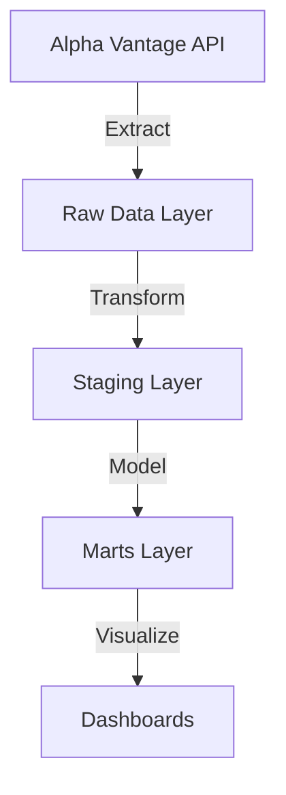
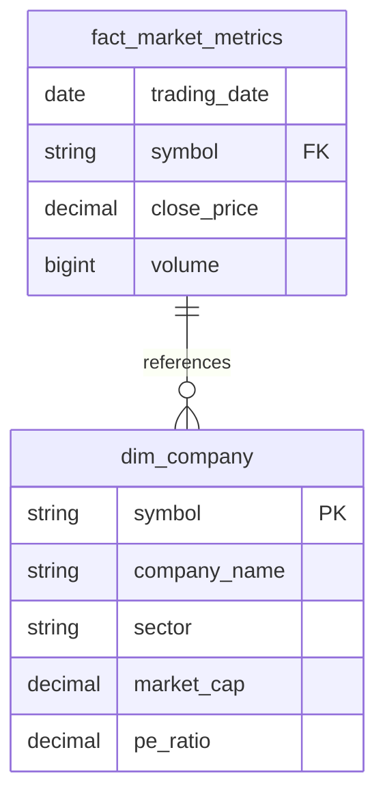

# Data Pipeline Guide: From API to Analytics

## 1. Overview of Data Flow



## 2. Step-by-Step Data Journey

### Step 1: Data Extraction
- **Source**: Alpha Vantage API
- **Tool**: Python (AlphaVantageClient in `src/extractors/alpha_vantage.py`)
- **What happens**:
  - We fetch stock prices and company information
  - Data is raw JSON from the API
  - Airflow orchestrates this process daily

### Step 2: Raw Data Storage
- **Location**: PostgreSQL database, `public_raw` schema
- **Tables**:
  - `raw_stock_prices`: Daily stock price data
  - `raw_company_info`: Company information
- **Example Raw Data**:
```sql
-- public_raw.raw_stock_prices
symbol    date        open    high    low     close   volume
AAPL     2024-01-28  185.20  188.45  184.90  187.85  75500000
```

### Step 3: Staging Layer (First Transformation)
- **What is Staging?**: 
  - First cleaning layer of raw data
  - Makes data consistent and reliable
  - Lives in `public_staging` schema
- **dbt Models**:
  - `stg_daily_prices`: Cleaned price data
  - `stg_company_info`: Cleaned company data
- **What happens here**:
  - Data type conversion
  - Column renaming
  - Basic data cleaning
  - No business logic yet

### Step 4: Marts Layer (Business Logic)
- **What are Marts?**:
  - Final, business-ready data models
  - Organized in star schema
  - Lives in `public_marts` schema
- **Models**:
  - `dim_company`: Company dimension table
  - `fact_market_metrics`: Market metrics fact table

## 3. Star Schema Explanation



## 4. dbt Project Structure

```
dbt/
├── models/              # All transformation logic lives here
│   ├── staging/        # First transformation layer
│   │   ├── schema.yml  # Defines data sources and tests
│   │   ├── stg_daily_prices.sql
│   │   └── stg_company_info.sql
│   └── marts/         # Business logic layer
│       ├── dim_company.sql
│       └── fact_market_metrics.sql
├── dbt_project.yml    # Main configuration
└── profiles.yml       # Database connection settings
```

## 5. How dbt Works

### Configuration (dbt_project.yml)
```yaml
name: 'tech_market_analytics'
models:
  tech_market_analytics:
    staging:
      +materialized: view    # Staging models are views
    marts:
      +materialized: table   # Marts are tables
```

### Model Example (Staging)
```sql
-- models/staging/stg_daily_prices.sql
SELECT
    symbol,
    date AS trading_date,
    CAST(open AS DECIMAL(10,2)) AS open_price,
    CAST(close AS DECIMAL(10,2)) AS close_price
FROM {{ source('raw', 'raw_stock_prices') }}
```

### Model Example (Mart)
```sql
-- models/marts/dim_company.sql
SELECT
    symbol,
    company_name,
    sector,
    market_cap,
    pe_ratio
FROM {{ ref('stg_company_info') }}
```

## 6. Data Flow Example

Let's follow a single piece of data:

1. **API Data**:
```json
{
    "symbol": "AAPL",
    "close": "187.85",
    "volume": "75500000"
}
```

2. **Raw Layer** (public_raw.raw_stock_prices):
```sql
symbol | close  | volume
AAPL   | 187.85 | 75500000
```

3. **Staging Layer** (public_staging.stg_daily_prices):
```sql
symbol | close_price | trading_volume
AAPL   | 187.85     | 75500000
```

4. **Marts Layer** (public_marts.fact_market_metrics):
```sql
trading_date | symbol | close_price | volume  | price_change_pct
2024-01-28   | AAPL   | 187.85     | 75500000| 1.25
```

## 7. Common dbt Commands

```bash
# Test connection
dbt debug

# Run all models
dbt run

# Run tests
dbt test

# Generate documentation
dbt docs generate
```

## 8. Checking Your Data

You can verify data at each layer using these queries:

```sql
-- Check raw data
SELECT COUNT(*) FROM public_raw.raw_stock_prices;

-- Check staging layer
SELECT COUNT(*) FROM public_staging.stg_daily_prices;

-- Check marts layer
SELECT COUNT(*) FROM public_marts.dim_company;
```

## 9. Troubleshooting

Common issues and solutions:

1. **No data in staging**:
   - Check if raw data exists
   - Verify dbt models ran successfully
   - Check for SQL errors in staging models

2. **Incorrect calculations**:
   - Review transformation logic in dbt models
   - Verify data types are correct
   - Check for NULL values

3. **Missing data**:
   - Verify API extraction worked
   - Check Airflow logs
   - Verify database connections 