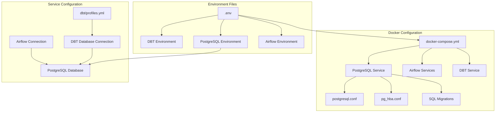
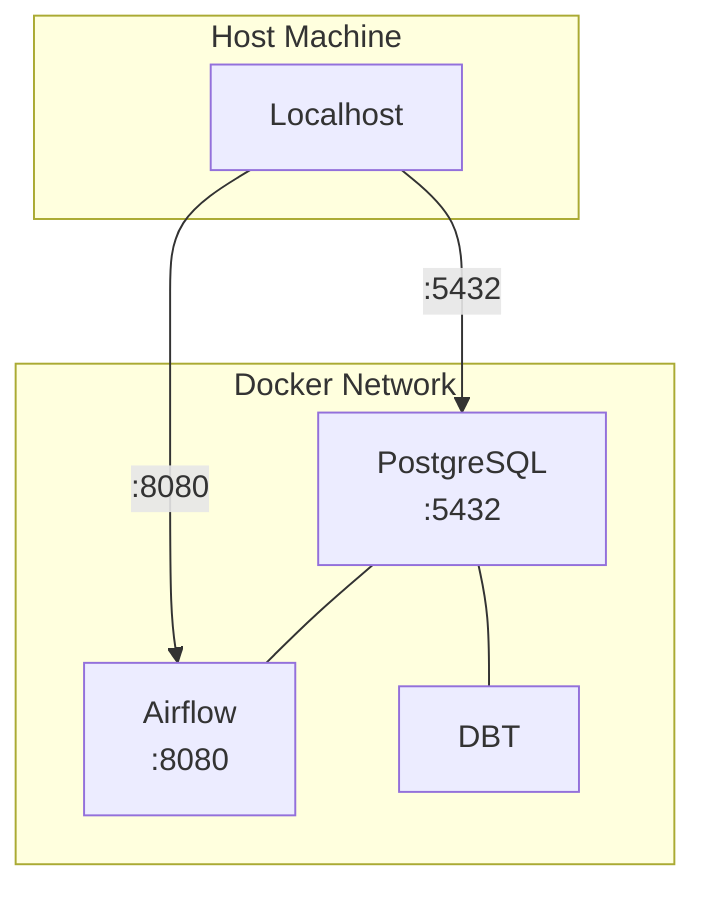
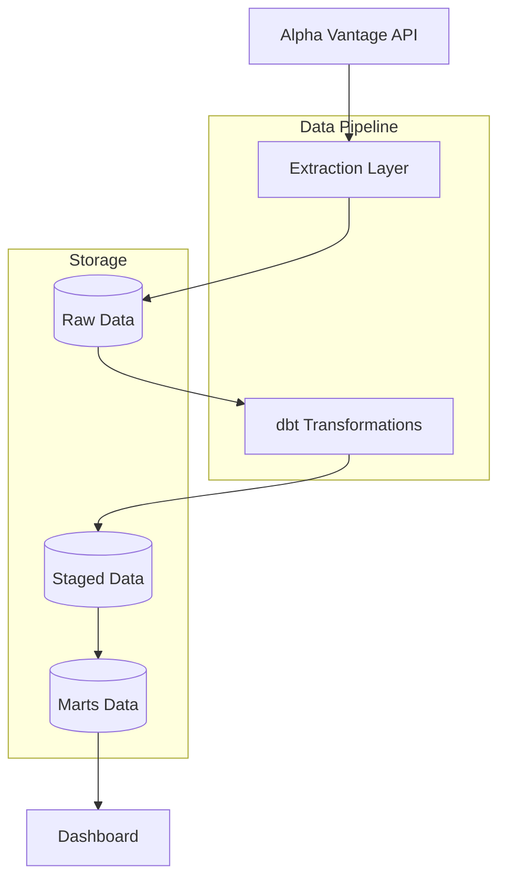

## Day 7: Environment Troubleshooting and Dashboard Development

### Environment and Dependencies Resolution
- **Issue**: Encountered segmentation faults when running the Streamlit dashboard due to Python version and package compatibility issues
- **Resolution**:
  - Migrated from Python 3.8 to Python 3.9
  - Implemented specific version constraints for key dependencies:
    - streamlit==1.24.1
    - pandas==1.5.3
    - plotly==5.18.0
    - psycopg2-binary==2.9.9
  - Successfully resolved segmentation faults and got the dashboard running

### Current Challenges
- **Database Connectivity**: Dashboard is unable to connect to PostgreSQL database
  - Error: "could not translate host name 'postgres' to address"
  - Root cause: Docker container networking issue - dashboard running on host machine cannot resolve Docker container hostname
  - Next steps: Update database connection configuration to use localhost or Docker network bridge

### Technical Learnings
1. **Python Environment Management**:
   - Importance of maintaining consistent Python versions across development
   - Critical role of package version compatibility in preventing runtime issues
   - Value of explicit version pinning for core dependencies

2. **Docker Networking**:
   - Need to consider network connectivity between host machine and containerized services
   - Importance of proper host resolution when accessing containerized databases

### Next Steps
1. Resolve database connectivity by updating connection configuration
2. Implement proper error handling in dashboard for database connection issues
3. Add connection retry logic with appropriate timeout settings

## Day 8: DAG Implementation and Import Error Resolution

### Airflow DAG Implementation and Debugging
- **Initial Challenge**: Import error in Airflow DAG
  - Error: `ModuleNotFoundError: No module named 'src'`
  - Root cause: Python path configuration in Docker container
  - Resolution: Added src directory to Python path in DAG file and updated Airflow Dockerfile

### Current DAG Architecture
1. **Data Extraction (Task 1)**:
   - Fetches daily stock data for key tech companies (AAPL, GOOGL, MSFT)
   - Implements rate limiting for API calls
   - Stores raw JSON responses in PostgreSQL

2. **Data Transformation (Task 2)**:
   - Executes dbt models for data transformation
   - Creates staging views for cleaned data
   - Builds dimensional model for company analytics

### Technical Learnings
1. **Airflow Configuration**:
   - Importance of proper Python path setup in containerized environments
   - Best practices for organizing custom modules in Airflow
   - Effective use of Airflow's BashOperator for dbt integration

2. **Data Pipeline Architecture**:
   - Separation of concerns between extraction and transformation
   - Benefits of using dbt for transformation layer
   - Importance of proper error handling in API calls

### Next Steps
1. **Pipeline Enhancement**:
   - Add more stock symbols for broader market coverage
   - Implement intraday data collection
   - Add error notifications via email/Slack
   
2. **Data Quality**:
   - Implement data freshness checks
   - Add data quality tests in dbt
   - Monitor API rate limits and failures

3. **Dashboard Improvements**:
   - Add technical indicators (Moving averages, RSI)
   - Implement real-time price updates
   - Add portfolio tracking functionality 

## Day 9: Deep Dive into Configuration Management and Debugging

### Configuration Architecture Overview



### Configuration Components and Their Roles

1. **Environment Variables** (.env)
   - Primary source of truth for credentials
   - Used by all services for consistent configuration
   - Structure:
     ```
     POSTGRES_USER=postgres
     POSTGRES_PASSWORD=postgres
     POSTGRES_DB=postgres
     POSTGRES_HOST=postgres
     POSTGRES_PORT=5432
     ```

2. **Docker Compose** (docker-compose.yml)
   - Service orchestration
   - Network configuration
   - Volume management
   - Port mapping:
     ```
     Ports Map:
     - PostgreSQL: 5432:5432
     - Airflow Webserver: 8080:8080
     ```

3. **PostgreSQL Configuration**
   - `postgresql.conf`: Server configuration
   - `pg_hba.conf`: Authentication rules
   - SQL migrations: Database initialization

### Debugging Journey and Lessons Learned

#### Challenge 1: PostgreSQL Configuration Mounting
1. **Initial Approach** (Failed)
   ```yaml
   volumes:
     - ./docker/postgres/postgresql.conf:/var/lib/postgresql/data/postgresql.conf
     - ./docker/postgres/pg_hba.conf:/var/lib/postgresql/data/pg_hba.conf
   ```
   - Issue: Directory not empty error
   - Lesson: PostgreSQL needs to initialize data directory first

2. **Second Approach** (Failed)
   ```yaml
   command: >
     bash -c "
       docker-entrypoint.sh postgres &
       sleep 10 &&
       cp /docker-postgres-config/*.conf /var/lib/postgresql/data/
     "
   ```
   - Issue: Permission problems with pg_ctl
   - Lesson: Complex startup scripts can be problematic

3. **Final Solution** (Successful)
   ```yaml
   environment:
     - POSTGRES_INITDB_ARGS=--auth-host=md5
   volumes:
     - postgres_data:/var/lib/postgresql/data
     - ./sql/migrations:/docker-entrypoint-initdb.d
   ```
   - Success: Let PostgreSQL handle its own initialization
   - Use SQL migrations for configuration changes

#### Challenge 2: Authentication Configuration
1. **Initial Setup** (Partial Success)
   - Used `trust` authentication
   - Security implications
   - Limited to local connections

2. **Improved Security** (Success)
   ```sql
   -- V3__update_auth.sql
   ALTER SYSTEM SET password_encryption = 'md5';
   ```
   - Implemented proper password authentication
   - Used SQL migrations for configuration

### Best Practices Established

1. **Configuration Management**
   - Use environment variables as single source of truth
   - Keep sensitive data in `.env` files
   - Use SQL migrations for database configuration

2. **Debugging Approach**
   - Start with simple configurations
   - Check logs immediately after changes
   - Use Docker health checks
   - Test connections from within containers first

3. **Service Dependencies**
   ```mermaid
   graph LR
       PG[PostgreSQL] --> AF_INIT[Airflow Init]
       AF_INIT --> AF_WEB[Airflow Webserver]
       AF_INIT --> AF_SCH[Airflow Scheduler]
       PG --> DBT[DBT]
   ```

### Configuration Files Map

```
datapipe_analytics/
├── .env                    # Main environment variables
├── docker-compose.yml      # Service orchestration
├── docker/
│   ├── postgres/
│   │   ├── postgresql.conf # Database configuration
│   │   └── pg_hba.conf    # Authentication rules
│   ├── airflow.Dockerfile  # Airflow image build
│   └── dbt.Dockerfile     # DBT image build
├── sql/
│   └── migrations/        # Database initialization
│       ├── V0__create_user.sql
│       ├── V1__initial_schema.sql
│       ├── V2__update_config.sql
│       └── V3__update_auth.sql
└── dbt/
    └── profiles.yml       # DBT connection configuration
```

### Network Architecture



### Lessons for Future ETL Projects

1. **Start Simple**
   - Begin with basic configurations
   - Add complexity incrementally
   - Test each component in isolation

2. **Configuration Priority**
   - Database setup first
   - Authentication second
   - Application configuration last

3. **Debugging Tools**
   - Docker logs
   - Database client tools
   - Network connectivity tests

4. **Common Pitfalls to Avoid**
   - Mounting configurations too early
   - Complex startup scripts
   - Mixing authentication methods
   - Inconsistent credentials across services

### Next Steps for Improvement

1. **Security Enhancements**
   - Implement SSL for database connections
   - Add connection pooling
   - Enhance password encryption

2. **Monitoring Additions**
   - Add logging aggregation
   - Implement metric collection
   - Create health check dashboard

3. **Maintenance Procedures**
   - Document backup procedures
   - Create recovery playbooks
   - Establish update protocols 

## Day 10: Pipeline Stabilization and Testing

### Achievements
1. **Pipeline Stability**:
   - Successfully fixed dbt test failures
   - Aligned model schemas with actual implementations
   - Verified end-to-end pipeline execution

2. **Data Quality**:
   - All 49 dbt tests passing
   - Implemented comprehensive testing across all models
   - Verified data consistency in transformations

3. **Infrastructure Health**:
   - PostgreSQL running with proper authentication
   - Airflow services (webserver + scheduler) operational
   - dbt transformations executing successfully

### Technical Learnings
1. **Data Pipeline Architecture**:
   - Importance of consistent column naming across models
   - Value of comprehensive dbt testing
   - Benefits of staged transformations (raw → staging → marts)

2. **Infrastructure Management**:
   - Docker container orchestration
   - Service health monitoring
   - Database connection management

### Next Steps
1. **Monitoring and Alerting**:
   - Implement Airflow email notifications
   - Add data freshness checks
   - Set up pipeline monitoring dashboard

2. **Data Enhancement**:
   - Add more stock symbols
   - Implement intraday data collection
   - Add technical indicators (Moving averages, RSI)

3. **Dashboard Development**:
   - Create Streamlit dashboard
   - Implement real-time price updates
   - Add portfolio tracking functionality

4. **Infrastructure Improvements**:
   - Implement proper logging
   - Add error recovery mechanisms
   - Optimize resource usage

### Current Architecture


### Testing Status
- Total Tests: 49
- Passed: 49
- Failed: 0
- Coverage Areas:
  - Data presence (not null)
  - Data uniqueness
  - Value constraints
  - Referential integrity 